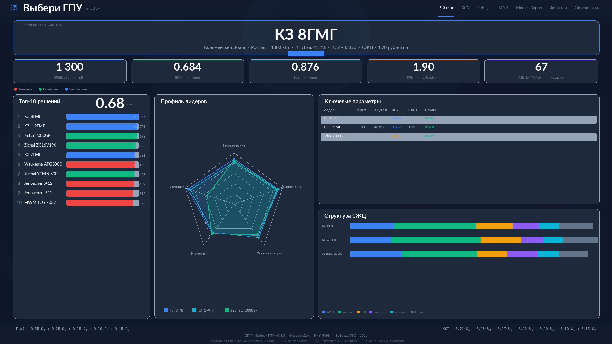

# ⚡ ГПУ эксперт v1.0

> СППР многокритериального выбора газопоршневых установок для генерирующих объектов



## О проекте

Система поддержки принятия решений (СППР) для выбора оптимальной газопоршневой установки (ГПУ) на основе нечёткого метода анализа иерархий (НМАИ) с интегрированным анализом стоимости жизненного цикла (СЖЦ) и комплексной санкционной устойчивости (КСУ).

**Ключевые возможности:**

- 67 моделей ГПУ (западные, китайские, российские)
- 15 критериев в 5 группах (FAHP Buckley)
- 11 компонент стоимости жизненного цикла
- 7 субкритериев санкционной устойчивости
- 3 санкционных сценария
- 8 категорий потребителей
- Анализ Монте-Карло
- Финансовый анализ (NPV, IRR, DPP)
- Полное обоснование выбора с формулами

## Запуск онлайн

Приложение доступно на Streamlit Community Cloud:

🔗 **[ggs-select.streamlit.app](https://ggs-select.streamlit.app)** *(после деплоя)*

## Локальный запуск

```bash
git clone https://github.com/YOUR_USERNAME/ggs-select.git
cd ggs-select
pip install -r requirements.txt
streamlit run app_v2.py
```

## Структура проекта

| Файл | Описание |
|------|----------|
| `app_v2.py` | Веб-интерфейс Streamlit (7 вкладок) |
| `gpu_select_core.py` | Расчётное ядро (FAHP, СЖЦ, КСУ, Монте-Карло) |
| `GPU_Database_v3.xlsx` | База данных 67 моделей ГПУ (33 параметра) |
| `.streamlit/config.toml` | Конфигурация тёмной темы |
| `requirements.txt` | Зависимости Python |

## Методология

- **НМАИ** — нечёткий метод анализа иерархий (Buckley's Fuzzy AHP) с треугольными нечёткими числами, дефаззификация методом центра тяжести
- **СЖЦ** — стоимость жизненного цикла по 11 компонентам с дисконтированием
- **КСУ** — комплексная санкционная устойчивость по 7 субкритериям

## Автор

**Кузнецов Д.А.**
Аспирант НИУ «МЭИ», кафедра теплоэнергетических систем (ТЭС)
Специальность 2.4.5 — Энергетические системы и комплексы

---
*Разработано в рамках диссертационного исследования, 2026*
